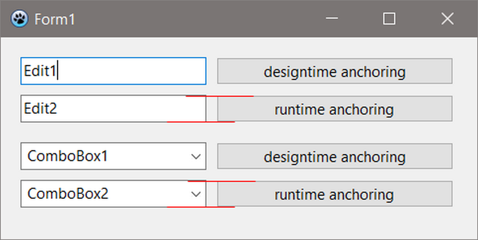

# test_laz_anchoring_top_bottom

This is a test project to verify that component bindings are displayed correctly.

 

Lazarus 4.99 (rev main_4_99-887-g4c39c0d55f) FPC 3.3.1 x86_64-win64-win32/win64

====

Lazarus 4.99 (rev main_4_99-1066-g5bcc39179c) FPC 3.3.1 x86_64-darwin-cocoa

====

Lazarus 4.99 (rev main_4_99-805-g2f94ecea69) FPC 3.3.1 x86_64-linux-gtk2

====

Lazarus 4.99 (rev main_4_99-853-gc288b1917c) FPC 3.3.1 x86_64-linux-qt5

